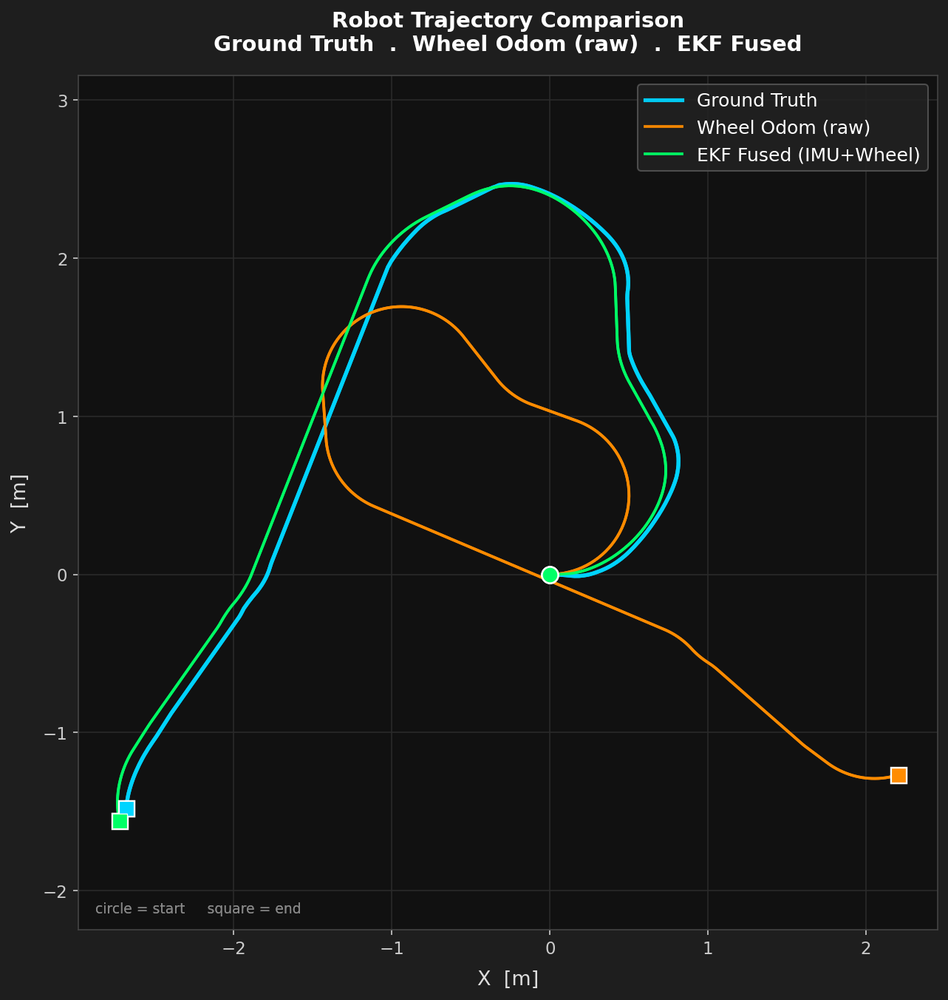

# ROS 2 Mobile Robot — Gazebo Simulation with Camera & LiDAR

A ROS 2 workspace featuring a custom differential-drive robot built from scratch, equipped with a **camera** and a **2D LiDAR**, and simulated inside a **Gazebo Harmonic** world.

---

## Demo Simulation



### Trajectory Comparison Video

<video src="https://github.com/user-attachments/assets/97c5b87f-d3a2-43bf-b124-8d56c4192317" controls="controls" muted="muted" style="max-width: 100%;">
  Your browser does not support the video tag.
</video>

---

## Features

- **Custom URDF/Xacro robot** — differential-drive mobile base with 4 wheels
- **Camera sensor** — 640×480 RGB camera mounted at the front of the robot, bridged to `/camera/image_raw` and `/camera/camera_info`
- **2D LiDAR sensor** — 360° laser scanner (640 samples, 10 m range) publishing to `/scan`
- **Gazebo Harmonic simulation** — custom SDF world with ground plane and environment objects
- **`ros_gz_bridge`** — full bidirectional bridge between Gazebo topics and ROS 2 topics
- **RViz2 visualisation** — pre-configured layout for TF, LaserScan, and camera feed

---

## Project Structure

```text
ros2-drone-gnss-ins-sim/          ← ROS 2 workspace root
├── README.md
├── .gitignore
├── urdf_config2.rviz
└── src/
    ├── my_robot_bringup/         # Launch, world, and bridge config
    │   ├── launch/
    │   │   └── my_robot_gazebo.launch.xml
    │   ├── config/
    │   │   └── gazebo_bridge.yaml
    │   ├── worlds/
    │   │   └── test_world.sdf
    │   ├── package.xml
    │   └── CMakeLists.txt
    └── my_robot_description/     # URDF/Xacro robot model + RViz config
        ├── launch/
        │   └── display.launch.xml
        ├── rviz/
        │   └── urdf_config.rviz
        ├── urdf/
        │   └── my_robot.urdf.xacro
        ├── package.xml
        └── CMakeLists.txt
```

> **Note:** `build/`, `install/`, and `log/` directories are generated at the **workspace root** by `colcon build` and are excluded via `.gitignore`. Always run `colcon build` from the workspace root, **not** from inside `src/`.

---

## Robot Model

The robot is defined in [`src/my_robot_description/urdf/my_robot.urdf.xacro`](src/my_robot_description/urdf/my_robot.urdf.xacro).

| Component | Details |
|---|---|
| **Base** | 0.6 × 0.4 × 0.2 m box, 5 kg |
| **Wheels** | 4 × cylinder (r = 0.1 m), continuous joints, differential drive |
| **Camera** | Front-mounted, 640×480 px, 80° FoV, 20 Hz, Gaussian noise |
| **LiDAR** | Top-mounted, 360°, 640 samples, 0.08–10 m, 10 Hz, Gaussian noise |

### Gazebo plugins

- `gz::sim::systems::DiffDrive` — velocity control via `/cmd_vel`
- `gz::sim::systems::JointStatePublisher` — publishes `/joint_states`
- `gz::sim::systems::Sensors` (camera + lidar) — sensor data

---

## Topic Bridge (`gazebo_bridge.yaml`)

| ROS 2 Topic | Gazebo Topic | Direction |
|---|---|---|
| `/clock` | `/clock` | GZ → ROS |
| `/joint_states` | `/world/empty/model/my_robot/joint_state` | GZ → ROS |
| `/tf` | `/model/my_robot/tf` | GZ → ROS |
| `/cmd_vel` | `/model/my_robot/cmd_vel` | ROS → GZ |
| `/camera/image_raw` | `/camera/image_raw` | GZ → ROS |
| `/camera/camera_info` | `/camera/camera_info` | GZ → ROS |
| `/scan` | `/scan` | GZ → ROS |

---

## Prerequisites

| Dependency | Version |
|---|---|
| ROS 2 | Jazzy (or Humble) |
| Gazebo | Harmonic |
| `ros_gz_sim` | matching distro |
| `ros_gz_bridge` | matching distro |
| `robot_state_publisher` | matching distro |

---

## Build & Run

```bash
# 1. Clone
git clone https://github.com/GAkbulutlar/ros2-drone-gnss-ins-sim.git
cd ros2-drone-gnss-ins-sim

# 2. Build (always from workspace root)
colcon build --symlink-install

# 3. Source
source install/setup.bash

# 4. Launch — Gazebo + RViz
ros2 launch my_robot_bringup my_robot_gazebo.launch.xml
```

To drive the robot:
```bash
ros2 run teleop_twist_keyboard teleop_twist_keyboard --ros-args -r cmd_vel:=/cmd_vel
```

To view the camera feed:
```bash
ros2 run rqt_image_view rqt_image_view /camera/image_raw
```

---

## Key Topics After Launch

```bash
ros2 topic list
# /camera/camera_info
# /camera/image_raw
# /clock
# /cmd_vel
# /joint_states
# /scan
# /tf
# /tf_static
```
